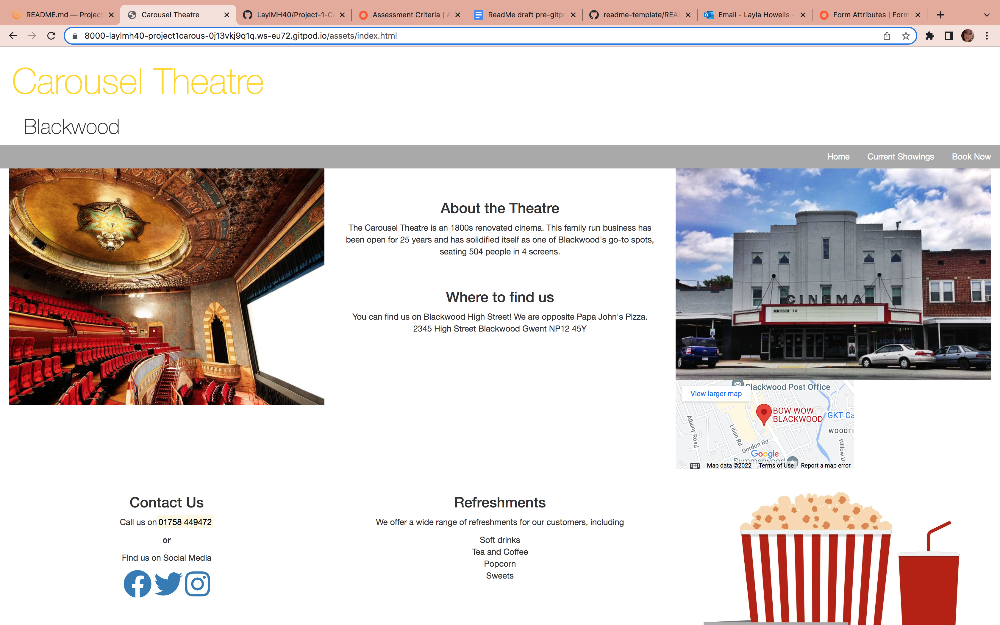
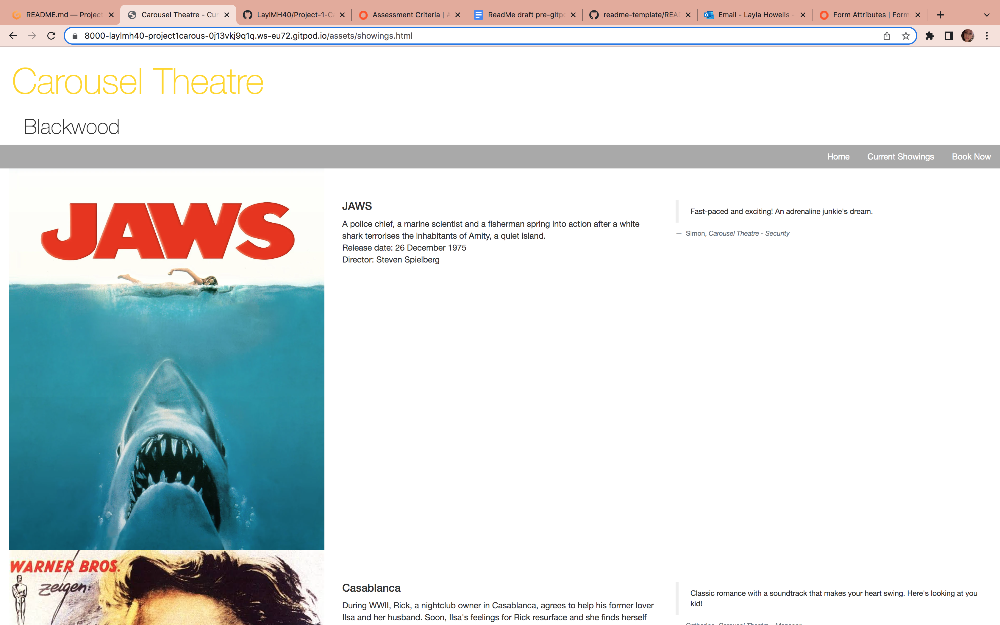
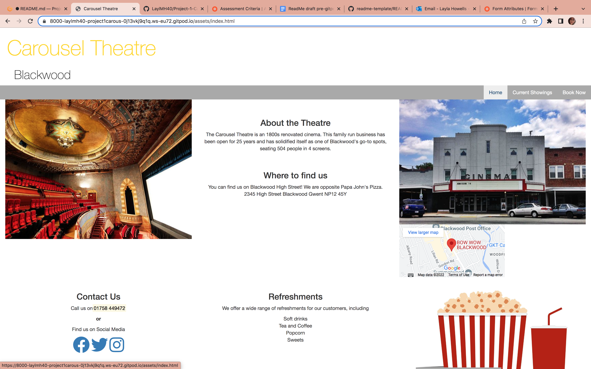
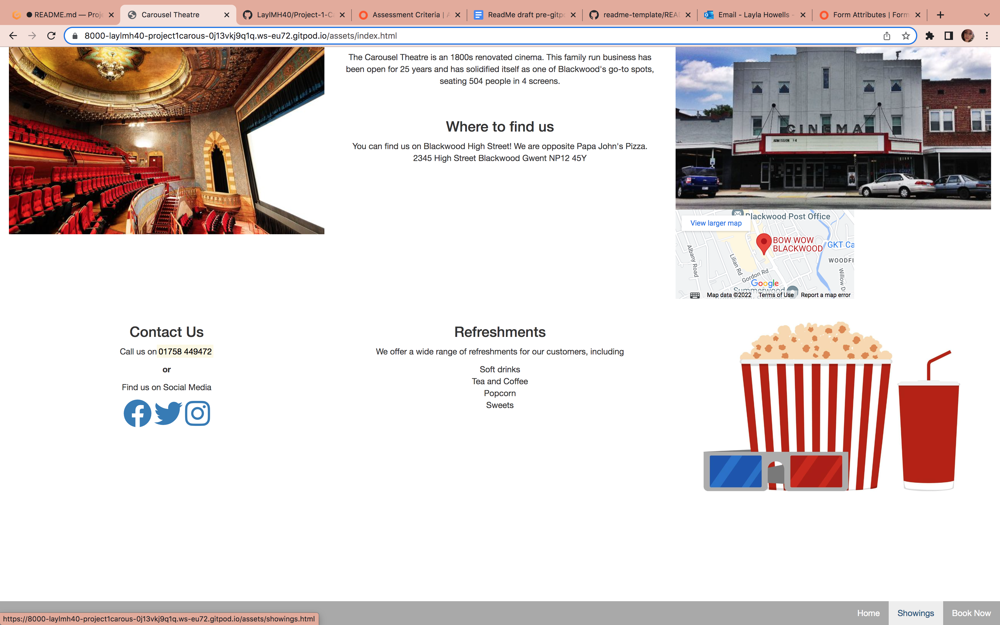
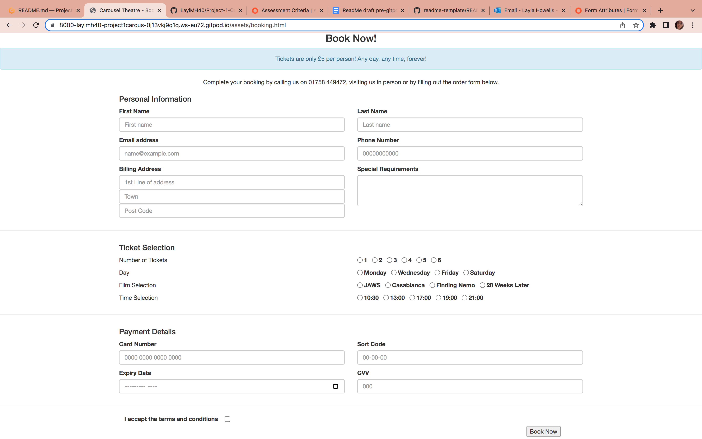
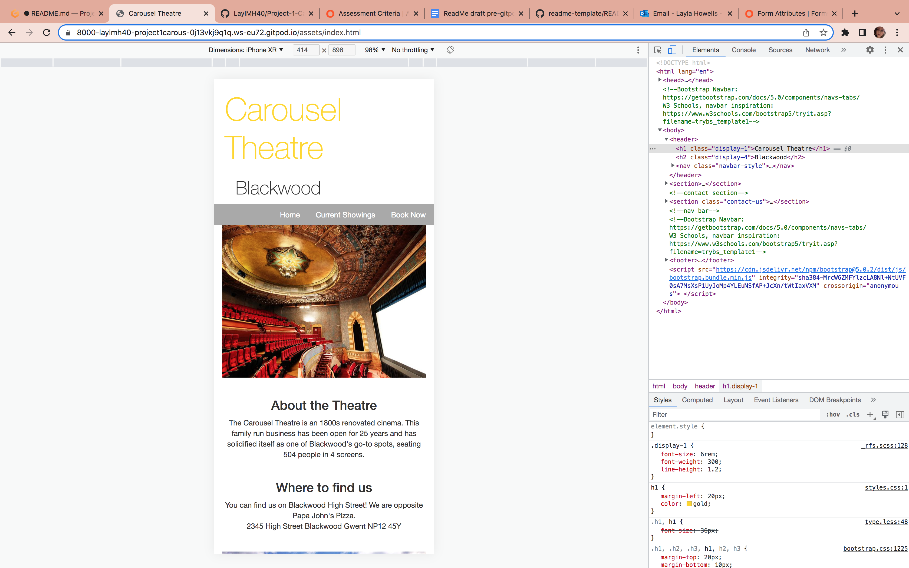

# Carousel Theatre Website
---
A website designed to bring an old theatre into the new world. The Carousel Theatre now turned cinema website allows users to learn about the theatre, find out important information (i.e. where it is, opening times, showing films) and allows site users to book tickets.

## Contents
This Readme file has been separated into different markdown files to reduce the amount of scrolling. Please find links to the various sections below. 
- [Wireframes](wireframes.md)
- [Testing](testing.md)
- [Resources](resources.md)
- [Deployment](deployment.md)

Please note that the User Experience section, Business Goals section and the Acknowledgements section are located in this file. 

### Business Goals
For this project, there are 2 main business goals.
- The first is to sell tickets to film showings
This is the primary purpose of the website. A place for users to purchase tickets. We have ensured this by the inclusion of the booking page and booking form. We have also minimalised of steps to purchase, ensuring there will be less users who abandon purchase due to long forms aka bad user experience. 
To encourage users to book tickets, there is a separate page of Current Showings. On this page, users can view images and read descriptions of the films which the theatre is currently showing. Alternatively, users may wish to book tickets by phone or in-person. They can do so by visiting the Homepage of the Carousel Theatre website. Included is a brief biography of the theatre, opening times, landline phone number and location. 
- To regain returning custom
This goal is less straightforward. We can attempt to say this will be achieved due to the standard of User experience on the site. This undoubtedly will play a part in return custom. However, this also has a lot of other determining factors which are not linked to user experience of the site, e.g. the user's experience of the theatre offline, the array of movies currently showing, etc. 

### User Experience
To maximise user experience we must first look at the user goals for this website. To do this clearly and effectively, please see the user stories below with assigned screenshots of the website.

#### User Story 1 - User would like to learn key information about the theatre
For this user story, I have provided the following features:
- Home page is full of key information
- Telephone number is easy to see as it is highlighted yellow
- Location of theatre is accompanied by a Google Maps iframe
Please see the screenshot below displaying this information. 

#### User Story 2 - User would like to know What is Currently showing? Which film should the user watch?
For this user story, I have provided the following features:
- A Currently showing page which displays the Film names, descriptions and movie posters.
- To combat the decision of which film to watch, there are reviews in blockquotes of the currently showing films to aid the user's decision.
Please see the screenshot below displaying this information. 

#### User Story 3 - User would like to Navigate the site easily.
For this user story, I have provided the following features:
- A navigation bar stretching the length of the page, with working internal links
- To ensure ease of use, the navigation bar runs along the header and footer of the page
- The background of the navigation links change color when hovered over, to allow the user to see what they are selecting
Please see the screenshot below displaying this information. 

#### User Story 4 - User would like to book tickets easily.
For this user story, I have provided the following features:
- A single page booking form allows for a simple booking experience. 
- The access to the booking form is easily available from the home page
Please see the screenshot below displaying this information. 

#### User Story 5 - User would like to use the site on their mobile phone
For this user story, I have provided the following features:
- The site is fully responsive 
- All elements of the site are available on the desktop, tablet AND mobile viewpoints.
Please see the screenshot below displaying this information. 

### Highlights of the User Experience
- The form 'Book Now!' button sends you to a Thank you page. This is good UX because it means the user doesn't have to press the 'go-back' button.
- The consistent styles across the pages of the site ensure a consistently good user experience.

### Acknowledgments
Sammy Dartnall - Mentor
- Sammy has been incredibly helpful in the creation of this project. Undoubtedly, could not have achieved this much without her support. 

Oliver Thomas - Partner
- My best friend, partner and code genius. Thank you for always being on hand to help me when I get stuck with code. Especially when I have stared at an error for 5 minutes and you see it instantly.